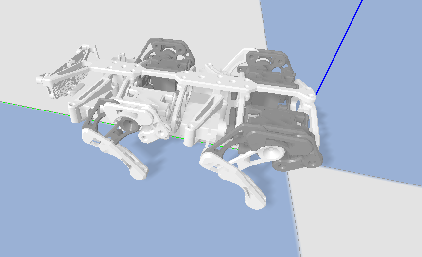
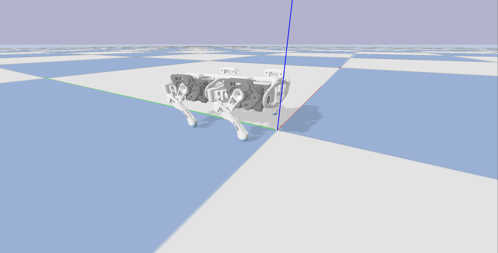
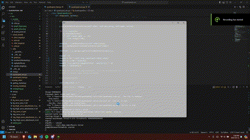
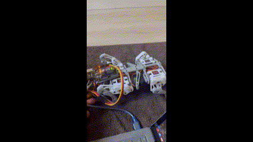

# quadrupedal-sim

## Overview

Using PyBullet to simulate quadrupedal robotic movement and PyTorch to implement a RL DDPG Agent in the simulation.

Using ROS2 Humble to port actions to real robot through UART.

## Motivation

The motivation of this project is robotics exploration and control system development. Robotics are fascinating and this being the first legitimate robot that I have created/implemented by myself brought engineering design challenges that I have yet to encounter in my previous experiences.

This project was a collaboration with my roommate. Majority of the CAD compenents and assembly was done by him. Using RL to walk for this task (walking in a straight line on a flat surface) is excessive, but the purpose of using RL is to potentially improve it in the future. The model can be improved to navigate different terrains and at different degrees of motion, similar to the SOLO12 or other quadrupedal implementations.

## RL Approach and Method

The reward function will be based on the position of the chassis. Unlike the Solo12 or other high-level quadrupeds using joint-independent reward functions (hierarchal policy gradient), this quadruped will use the chassis' RPY + velocity.

DDPG (Deterministic Deep Policy Gradients) will be the approach for this problem. It is an actor-critic algorithm, the actor being a policy gradient and the critic being a DQN or Q-Network. The actor trains off the DQNs results and the rewards of its actions. DDPGs support multiple continuous actions which is perfect for a robotics application such as making a quadruped walk.

### Physical robot:

<p align="center">
  
</p>

### Initial robot:

<p align="center">
  
</p>

### Final robot:

<p align="center">
  
</p>

## Training Process

Agent will be provided chassis RPY and joint positions. Agent will generate action consisting of position control values for each DOF every 60 timesteps or every .25 seconds. Simulation will reset every 10 seconds (each episode is 10 seconds).

First step:

<p align="center">
  
</p>

Current model:

<p align="center">
  
</p>

<p align="center">
  
</p>

** The centre of balance is since the battery is not installed, but no force is applied forward.

## Reward Values

$`reward = 120 * (\Delta d) - sqrt((0.0522 - h)^2) - 0.1(|r| + |y|)`$

## Running

Using Python 3.10.12 and ROS2 Humble.

Setup for Training and Simulation: 
```shell
git clone <repo>
sudo apt-get install -y python3-venv
mkdir venv && cd venv
python -m venv .

source lib/activate
cd ../sim/src/moving_model
python moving_model.py

```
If you are having issues with setting venv and ROS2, it is a [known issue](https://github.com/ros2/ros2/issues/1094) with no fix yet.

ROS:
```shell
source <ros_distro>/install/setup.bash
source ros/install/setup.bash

colcon build
ros2 run model talker
```

** I ran into a lot of issues running a venv w/ ROS2, better to use rosdep instead. If I were to redo this project, I would purely use rosdep instead of venv to keep dependencies in one place.

## Encountered Problem Log

1) During research, my first problem was that most PGs are essentially Markov Chains which will have only 1 probabilistic action for each given observation. Vanilla Policy Gradients and the REINFORCE algorithm are simple on-policy algorithms that I started with. The probabilities for each action in these algorithms are generated from the agent and the action with the highest probability is selected. The negative values are multiplied with standardized rewards and summed as the loss where SGD optimizes it. This is insufficient for the robot as position values are required + deterministic action.\
Multiple approaches can be taken to get a 12-continuous action space from the internet. DDPG and Hierarchal Policy Gradients are popular approaches to solve this problem. [Starcraft 2](https://arxiv.org/abs/1708.04782) agent experiment by OpenAI uses A3C, which can also handle large action spaces and has an incredibly complex agent structure.\
It is possible to map the stochastic policy to the min and maxes of each joint and try to do one action at a time. However, if I were to do this, it would be a wiser use of time to implement DDPG as the robot would be deterministic and would be able to have multiple actions at a time. DDPG only supports continuous action spaces with a deterministic policy, perfect for this application.

2) Curse of dimensionality for this problem as well. From DQN to PGs this problem remains as deterministic or stochastic problems can have trouble mapping the network output to discrete action spaces. For the quadruped robot, the joint can move around 1.07 rad each which could be discretized to 0.2 rad since both DQNs and PGs can only produce 1 discrete action (to move 0.2 rad or not to move 0.2 rad). Would this 0.2 rad be too much or too little? If we were to do this for each joint it would increase exponentially, thus a continuous action space would be required. (actually, PGs can bypass this problem by interpreting the output as $`\ log(\theta) `$ to sample any number, instead of the output of $`\ \mu `$ see [this](https://datascience.stackexchange.com/questions/61707/policy-gradient-with-continuous-action-space).) 

3) During initial phases of training, I found many errors in the simulation that prevented an effective policy being learned by the agent. At this point, errors could be from both PyBullet sim and the implementation of the DDPG. Through playing with the simulation in moving_robot.py, I found that friction and the normal force on each joint was not enough to push the robot forward. The center of gravity of the robot caused tipping of the robot. Edits to the CAD files and simulation tweaking was required.

4) DDPG convergence issues. This is a foreseeable problem with DDPGs as they tend to converge to absolute values (1 or 0) if a policy is not found through the random OU function. I found that if the agent did not find a suitable policy with the random function within the first 400 iterations, it would not learn a non-trivial policy. Playing with parameters with the OU function to make sure that the agent converged well and changing the simulation i.e changing materials, center of balance, and contact points to eventually learn a decent policy.

5) PyBullet provides 3 ways to control the joints. Positional, velocity and torque control. I chose positional at the beginning due to it being easy to map with the action space of the agent. However, with the nature of stepping the environment, the actions are very choppy and not entirely smooth. The resulting optimal policy from this control scheme is having 2 feet move of the 4 to maintain balance in the robot during non-action simulation steps. I started exploring with velocity and torque control since they can result in continuous movements.

## Resources:

[reddit](https://www.reddit.com/r/MachineLearning/comments/9z8tok/d_reinforcement_learning_with_multiple/) \
[git](https://pemami4911.github.io/blog/2016/08/21/ddpg-rl.html#References) \
[stack](https://stackoverflow.com/questions/43881897/what-is-the-policy-gradient-when-multiple-actions-are-possible) \
[torcs_ddpg](https://yanpanlau.github.io/2016/10/11/Torcs-Keras.html) \
[ddg_blog](https://pemami4911.github.io/blog/2016/08/21/ddpg-rl.html#References) \
[Baeldung](https://www.baeldung.com/cs/rl-deterministic-vs-stochastic-policies#:~:text=The%20primary%20difference%20between%20a,over%20actions%20for%20each%20state.)

Inspiration articles from [OpenAI](https://spinningup.openai.com/en/latest/spinningup/rl_intro3.html) and [Andrei Karpathy](https://karpathy.github.io/2016/05/31/rl/).
